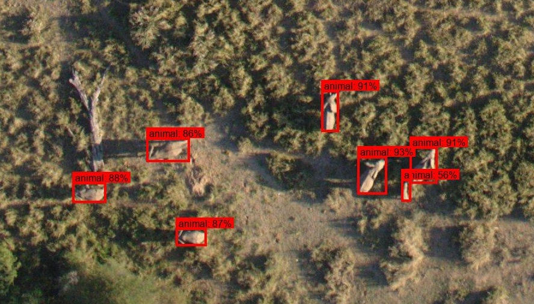
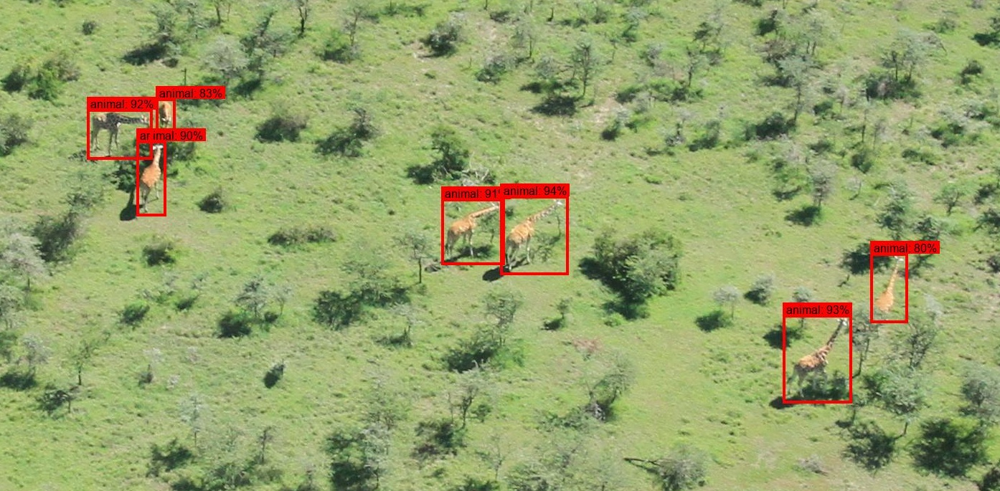
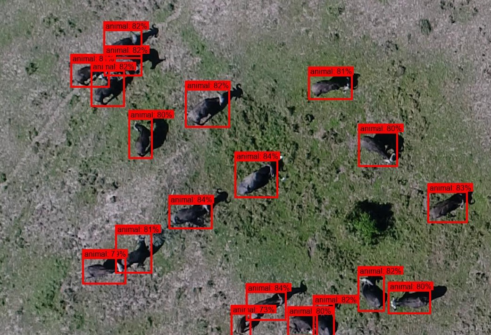
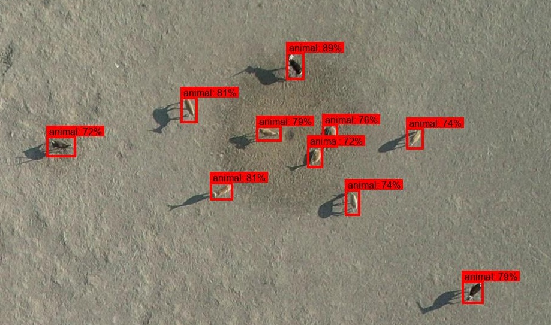
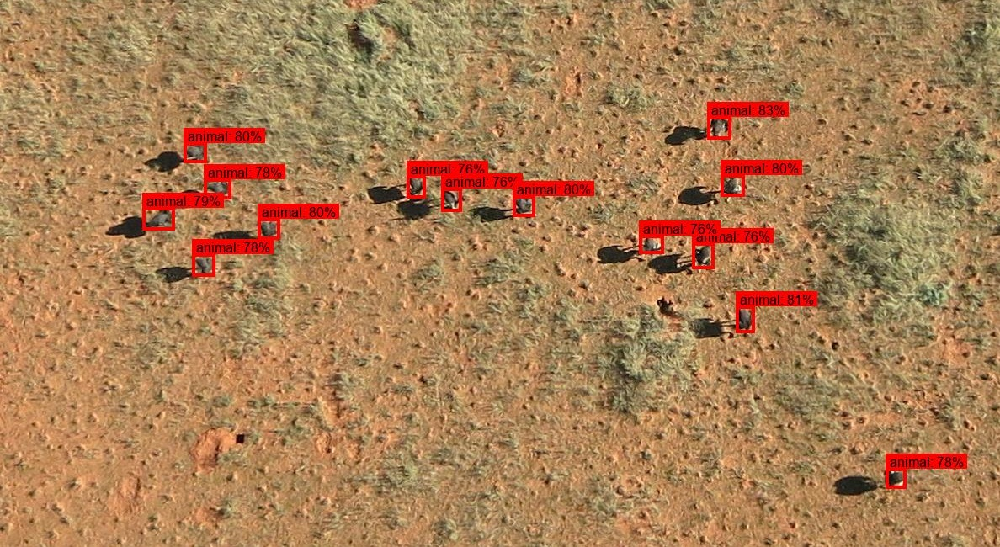

# DroneMegaDetector

## Contents

* [Overview](#overview)
* [Model categories](#model-categories)
* [Flight altitude and image scale](#flight-altitude-and-image-scale)
* [Running the model](#running-the-model)
* [Hugging Face repository](#hugging-face-repository)
* [Sample output](#sample-output)


## Overview

This repository provides an object-detection model for detecting mammals in drone-based wildlife surveys. The model is intended primarily for drone imagery, but the training data includes some imagery from crewed aircraft.


## Model categories

The detector is based on [RF-DETR Medium](https://rfdetr.roboflow.com/reference/medium/) and is trained as a three-class object detector:

| Class ID | Class   |
| -------: | ------- |
|        0 | Person  |
|        1 | Animal  |
|        2 | Vehicle |

The "animal" category is really a "mammal" category; almost all of the training examples for this category are mammals, so the behavior on non-mammal animals is undefined.


## Flight altitude and image scale

The model's training data predominantly represents drone flights conducted at approximately 50-120 m above ground level.  This range should be considered the principal operating range represented by the training data, rather than a strict altitude requirement.

As altitude increases, animals occupy fewer pixels in the image. Detection performance can therefore decline when targets become substantially smaller than those represented in the training imagery.


## Running the model

We provide two inference scripts:

* `inference-demo.py` is a simple script that runs on a single image, intended for quick testing to make sure the model runs properly in your environment.  This script creates and displays an annotated image, but doesn't write results to a file.
* `inference-batch.py` is intended for practical workflows; it processes a folder recursively and writes results to a .json file.

### Using inference-demo.py

`inference-demo.py` is designed to run the model on a single image, to quickly test whether the model is running correctly in your environment.

Usage:

```bash
python inference.py \
    --image path/to/image.jpg \
    --weights path/to/model.pth \
    --conf 0.5 \
    --output output.jpg
```

Arguments:

| Argument    | Required | Description                           |
| ----------- | -------- | ------------------------------------- |
| `--image`   | Yes      | Path to the input image               |
| `--weights` | Yes      | Path to the RF-DETR `.pth` checkpoint |
| `--conf`    | No       | Detection confidence threshold        |
| `--tiled`   | No       | Enables tiled inference               |
| `--output`  | No       | Path for the annotated output image   |

The default confidence threshold is `0.5`.

If the input filename is "image.jpg", the default output filename is "image.annotated.jpg".

### Using inference-batch.py

`inference-batch.py` runs the model on all the images and videos in a folder (recursively), or on a single image or video file, and writes the results to a .json file in the [MegaDetector output format](https://lila.science/megadetector-output-format).

Usage:

```bash
python inference-batch.py \
    path/to/model.pth \
    path/to/folder \
    path/to/results.json \
    --tiled
```

Arguments:

| Argument                   | Required | Description                                                                                         |
| -------------------------- | -------- | --------------------------------------------------------------------------------------------------- |
| `detector_file`            | Yes      | Path to the RF-DETR `.pth` checkpoint                                                               |
| `folder`                   | Yes      | Folder of images and/or videos (searched recursively), or a single image or video file              |
| `output_file`              | Yes      | Path for the output .json file                                                                      |
| `--threshold`              | No       | Detection confidence threshold (default `0.005`)                                                    |
| `--tiled`                  | No       | Enables tiled inference                                                                             |
| `--tile_overlap`           | No       | Tile overlap, in pixels or as a fraction of the tile size (default `100`); implies `--tiled`        |
| `--batch_size`             | No       | Number of images (or tiles, with `--tiled`) to run through the model at once (default `1`)          |
| `--image_size`             | No       | Inference resolution, and tile size with `--tiled` (default: the training resolution, 1280)         |
| `--include_image_size`     | No       | Include each image's width and height in the output                                                 |
| `--loader_workers`         | No       | Number of parallel image loading workers (default `4`)                                              |
| `--worker_type`            | No       | Use `thread` or `process` workers for image loading (default `thread`)                              |
| `--skip_images`            | No       | Only process videos                                                                                 |
| `--skip_video`             | No       | Only process images                                                                                 |
| `--time_sample`            | No       | For videos, process one frame every N seconds (default `1.0`)                                       |
| `--frame_sample`           | No       | For videos, process every Nth frame (instead of `--time_sample`)                                    |
| `--optimize_for_inference` | No       | Compile the model for faster inference; results may differ slightly from the uncompiled model       |
| `--verbose`                | No       | Enables additional debug output                                                                     |

Videos are processed by sampling frames (one frame per second by default).  Each video gets a single entry in the output file, and each detection includes the `frame_number` of the frame it came from.

### Tiled inference

Both inference scripts support tiled inference for large images.  Tiled inference divides the input image into 1280 × 1280 pixel tiles (matching the resolution at which the model was trained) and performs detection independently on each tile before combining the detections.  Adjacent tiles overlap by 100 pixels by default (`inference-batch.py` can change this with `--tile_overlap`), and duplicate detections in overlapping regions are removed with non-maximum suppression.  Enable tiled inference using the `--tiled` argument.

Tiled inference can be useful when each image is substantially larger than the model's training resolution (1280 × 1280), particularly when animals occupy a small proportion of the full image.


## Hugging Face repository

The model is also available via Hugging Face at:

> https://huggingface.co/ConservationDrones/DroneMegaDetector

A demo inference script for the Hugging Face repository is provided as [hugging-face-demo.py](src/hugging-face-demo.py).


## Sample output

This section contains sample detector output on a variety of datasets.  No effort was made to determine whether these sample images were included in the training data, so this section is just here to give you a sense of what the model does, not to communicate accuracy.

<br/>
Image from the <a href="https://zenodo.org/records/3234780">Aerial Elephant Dataset</a>.<br/>

<br/>
Image from <a href="https://data.4tu.nl/articles/dataset/Improving_the_precision_and_accuracy_of_animal_population_estimates_with_aerial_image_object_detection/12713903/1">Improving the precision and accuracy of animal population estimates with aerial image object detection</a>.<br/>

<br/>
Image from <a href="https://edmond.mpg.de/dataset.xhtml?persistentId=doi:10.17617/3.EMRZGH">Quantifying the movement, behaviour and environmental context of group-living animals using drones and computer vision</a>.<br/><br/>

<br/>
Image from the <a href="https://edmond.mpg.de/dataset.xhtml?persistentId=doi:10.17617/3.JCZ9WK">BuckTales</a> dataset.<br/>

<br/>
Image from the <a href="https://huggingface.co/datasets/fadel841/savmap">SAVMAP</a> dataset.<br/>

